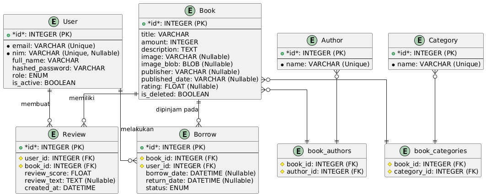
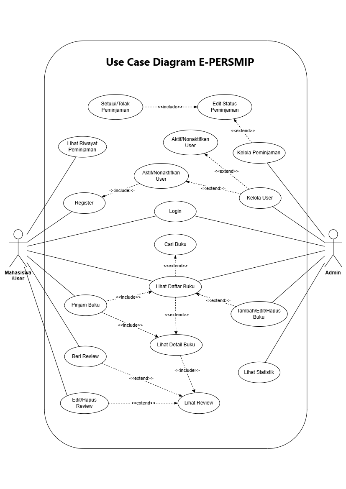
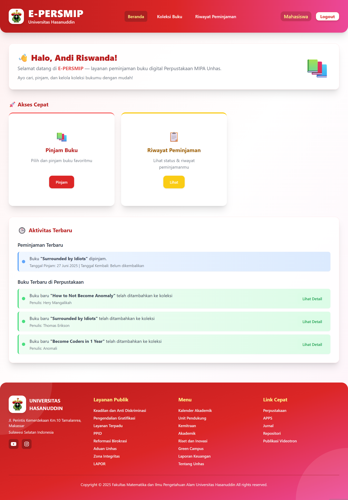
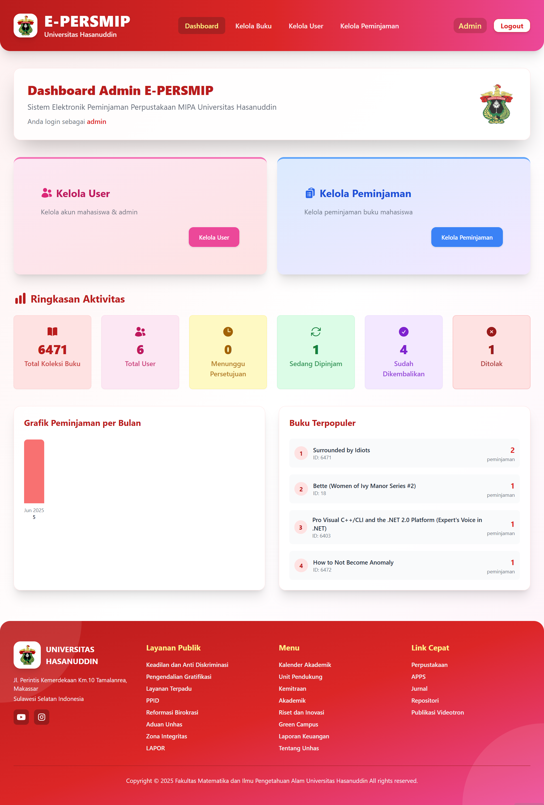
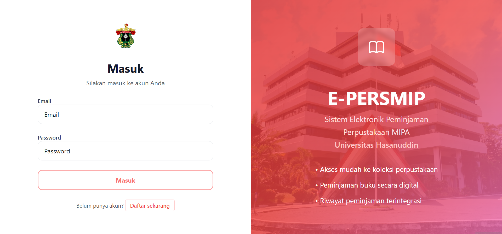
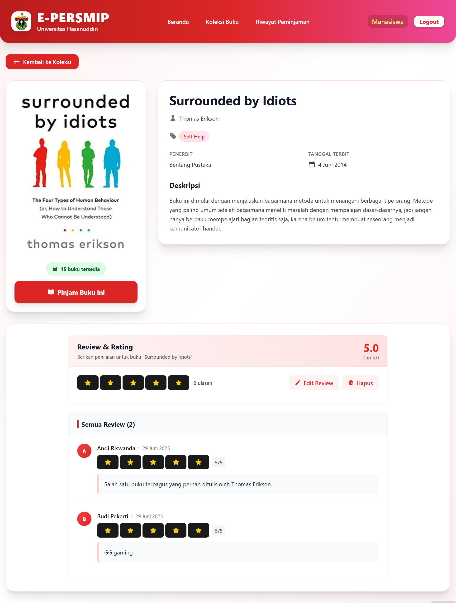
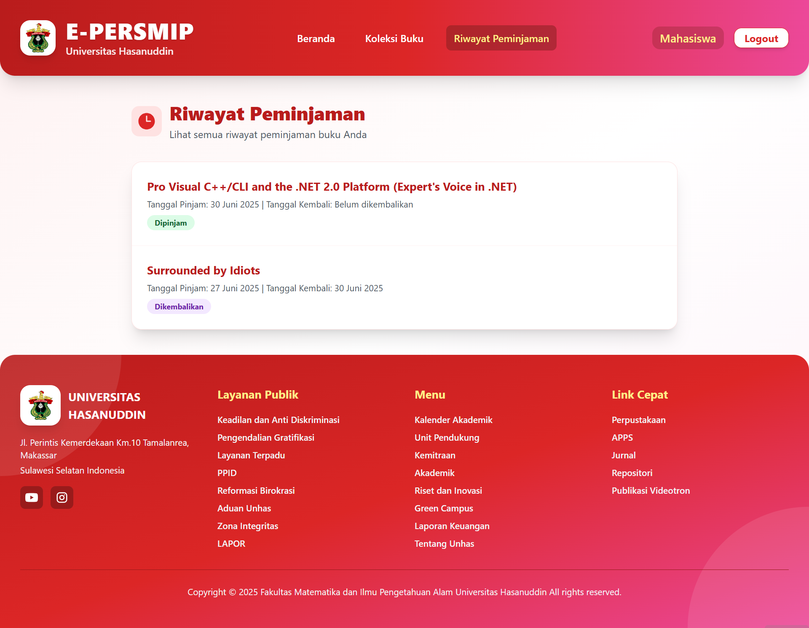

# E-PERSMIP 📚

**E-PERSMIP** (Elektronik Peminjaman Perpustakaan MIPA) adalah aplikasi web modern untuk manajemen peminjaman buku di Perpustakaan Fakultas MIPA Universitas Hasanuddin.

---

## ✨ Fitur Utama

- 🔐 **Sistem Autentikasi**: Login/Register untuk mahasiswa dan admin dengan keamanan JWT.
- 📖 **Katalog Buku**: Jelajahi, cari, dan filter koleksi buku perpustakaan secara real-time.
- 📋 **Manajemen Peminjaman**: Proses peminjaman, pengembalian, dan riwayat transaksi buku.
- 📝 **Ulasan Buku**: Pengguna dapat memberikan rating dan review pada buku.
- 📊 **Dashboard Statistik**: Monitoring aktivitas peminjaman, statistik buku, dan pengguna.
- 👤 **Manajemen User & Admin**: Pengelolaan data user dan admin oleh admin.
- 🌙 **Dark/Light Mode**: Tampilan antarmuka yang dapat disesuaikan.
- 📱 **Responsive Design**: Kompatibel di desktop, tablet, dan mobile.

---

## 🗂️ ERD (Entity Relationship Diagram)

Berikut adalah diagram relasi basis data (ERD) yang digunakan pada aplikasi E-PERSMIP:



---

## 📝 Use Case Diagram

Berikut adalah diagram use case utama aplikasi E-PERSMIP:



---

## 🛠️ Tools & Teknologi yang Digunakan

<p align="center">
  
  
  
  
  
  
  
</p>

- **Frontend**: React.js, Vite, Tailwind CSS, DaisyUI
- **Backend**: FastAPI (Python)
- **Database**: SQLite
- **State Management**: React Hooks
- **Icons**: Heroicons, DaisyUI Icons
- **Build Tool**: Vite

---

## 🖼️ UI Website

Tampilan antarmuka E-PERSMIP didesain modern, minimalis, dan responsif. Berikut beberapa contoh halaman utama:

### **Landing Page**: Tampilan Home E-PERSMIP


### **Daftar Buku**: Menampilkan katalog buku dan fitur pencarian.


### **Dashboard Admin**: Statistik peminjaman, manajemen user, buku, dan kategori.


### **Halaman Login/Register**: Autentikasi user dan admin.


### **Detail Buku**: Informasi lengkap buku, ulasan, dan tombol peminjaman.


### **Riwayat Peminjaman**: Riwayat dan status peminjaman user.


---

## ⚙️ Instalasi & Setup

### 1. Clone Repository

```bash
git clone https://github.com/username/E-PERSMIP.git
cd E-PERSMIP
```

### 2. Setup Backend (FastAPI)

Masuk ke folder backend:

```bash
cd backend
```

Install dependencies Python (gunakan virtual environment direkomendasikan):

```bash
pip install -r requirements.txt
```

Jalankan server FastAPI:

```bash
uvicorn app.main:app --reload
```

Server backend akan berjalan di `http://localhost:8000`

> **Opsional:**
> Untuk mengisi data awal, jalankan script seed:
>
> ```bash
> python scripts/seed_database.py
> ```

### 3. Setup Frontend (React + Vite)

Masuk ke folder frontend:

```bash
cd frontend
```

Install dependencies:

```bash
npm install
```

Jalankan development server:

```bash
npm run dev
```

Frontend akan berjalan di `http://localhost:5173`

### 4. Build & Preview Production

Build frontend untuk production:

```bash
npm run build
```

Preview hasil build:

```bash
npm run preview
```

---

## 🤝 Kontribusi

Kami menyambut kontribusi untuk pengembangan E-PERSMIP! Silakan:

1. Fork repository ini
2. Buat branch fitur baru (`git checkout -b feature/AmazingFeature`)
3. Commit perubahan (`git commit -m 'Add some AmazingFeature'`)
4. Push ke branch (`git push origin feature/AmazingFeature`)
5. Buat Pull Request

## 👥 Tim Pengembang

- Rudy Peter Agung Chendra    (H071231015)
- Muhammad Qaffal AL Fifaiz   (H071231032)
- Cholyn Sharon Enos          (H071231040)

---

## 📚 Kesimpulan

E-PERSMIP adalah solusi digital modern untuk manajemen perpustakaan berbasis web yang mudah digunakan, aman, dan responsif. Dengan fitur lengkap mulai dari katalog buku, peminjaman, hingga dashboard statistik, aplikasi ini mendukung digitalisasi layanan perpustakaan di lingkungan Fakultas MIPA Universitas Hasanuddin.

Kontribusi, saran, dan pengembangan lebih lanjut sangat terbuka untuk meningkatkan kualitas aplikasi ini.

---

**Dibuat dengan ❤️ oleh Tim E-PERSMIP**
